# ExpenseFlow API — Architecture & Decisions

> **Scope.** ExpenseFlow is a proof-of-concept expense API with a single journey:
> **submit** an expense → **convert** it to a base currency (INR) → **approve or reject** it.
> This document catalogues every architectural decision visible in the codebase, with a
> diagram and an insight for each. Diagrams are [Mermaid](https://mermaid.js.org/) and render
> on GitHub.
>
> _Note: `CLAUDE.md` still describes the project as "not yet implemented"; that status is
> stale — the app, ORM models, routes, and test suite are all present and working._

---

## System context

The whole system is one process plus a SQLite file plus one outbound HTTP dependency.

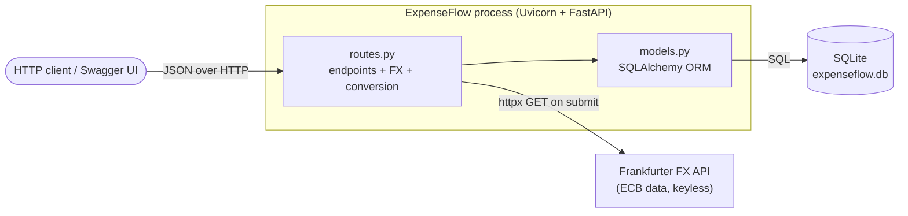

**Insight.** Everything is deliberately *co-located and few-moving-parts*: one deployable, one
embedded datastore, one external call. That is the right shape for a PoC — it maximises the
ratio of demonstrated behaviour to operational surface. Every decision below is a variation on
the same theme: **keep the seams clean so the PoC can grow up, but don't pay for scale that
isn't needed yet.**

---

## ADR-01 — Modular monolith with a layered package layout

The app is split into five files, each a single responsibility layer.

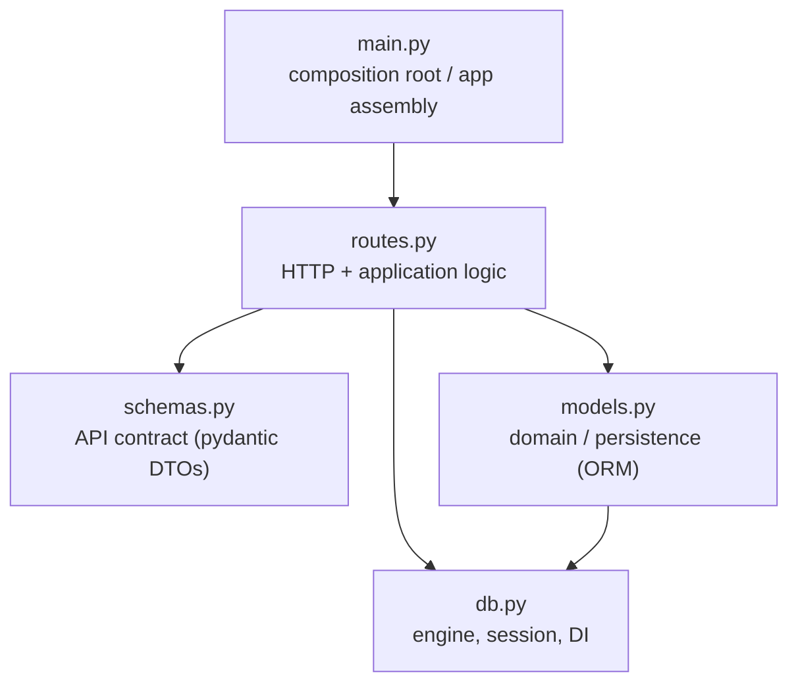

**Decision.** `main.py` (assembly) → `routes.py` (transport + logic) → `schemas.py` (contract)
/ `models.py` (entities) → `db.py` (infrastructure). Dependencies point one way, toward
infrastructure.

**Insight.** This is a layered monolith, not microservices — the correct default until scaling
or team boundaries force otherwise. The value is the *direction* of dependencies: `db.py`
knows nothing about routes, `models.py` knows nothing about HTTP. That acyclic graph is what
lets you later swap SQLite for Postgres, or lift `routes.py` logic into a service layer,
without a rewrite. The one impurity to watch: business logic (FX conversion, state
transitions) currently lives in `routes.py` — fine at this size, the first thing to extract
into a `service.py` when rules multiply.

---

## ADR-02 — FastAPI + Uvicorn as the web stack

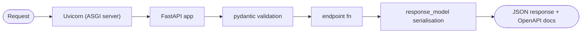

**Decision.** FastAPI on the Uvicorn ASGI server, with automatic OpenAPI/Swagger at `/docs`
and ReDoc at `/redoc`.

**Insight.** FastAPI folds four concerns — routing, request validation, response
serialisation, and live API documentation — into type hints you were going to write anyway.
For a PoC whose job is to *demonstrate* a contract, the free interactive docs are worth as much
as the runtime: a reviewer can exercise the whole journey without curl. The trade-off is a
framework-coupled contract (decorators, `Depends`), which is acceptable because the contract is
the product here.

---

## ADR-03 — SQLAlchemy 2.0 typed ORM on SQLite

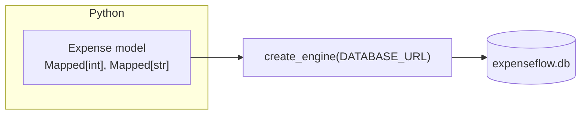

**Decision.** SQLAlchemy 2.0 declarative models with typed `Mapped[...]` columns, over an
SQLite file. The engine is chosen by `DATABASE_URL`, with `check_same_thread=False` applied
only for SQLite URLs.

**Insight.** Two decisions are nested here. First, an **ORM over raw SQL**: cheap object
mapping and a migration path to another RDBMS. Second, **SQLite as the engine**: zero-install,
file-based, perfect for a PoC and tests. The tell that this was designed to outgrow SQLite is
the conditional `connect_args` — the SQLite-specific `check_same_thread` flag is gated behind a
URL check, so pointing `DATABASE_URL` at Postgres needs no code change. SQLite's real limits
(single writer, weak concurrency) simply don't bind at PoC scale.

---

## ADR-04 — Session-per-request via dependency injection

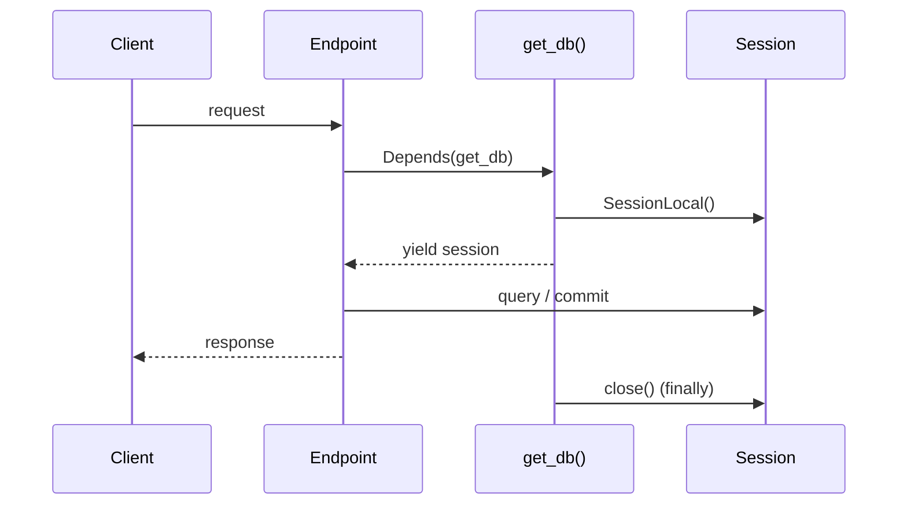

**Decision.** `get_db()` is a generator dependency: it opens a `Session`, `yield`s it to the
endpoint, and closes it in a `finally`. Every endpoint receives its session via
`Depends(get_db)`.

**Insight.** This is the unit-of-work pattern expressed as a FastAPI dependency. Each request
gets exactly one session whose lifetime is bounded by the request, and the `try/finally`
guarantees the connection returns to the pool even on error. Crucially, because the session is
*injected* rather than imported, tests can override it (see ADR-16) — DI here buys both
correctness (no leaked connections) and testability (no global state) from a single seam.

---

## ADR-05 — Pydantic DTOs kept separate from ORM entities

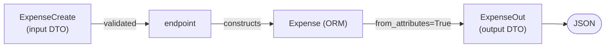

**Decision.** The wire contract lives in `schemas.py` (`ExpenseCreate`, `ExpenseOut`), distinct
from the storage schema in `models.py` (`Expense`). `ExpenseOut` reads straight off the ORM
object via `ConfigDict(from_attributes=True)`.

**Insight.** Never let the database schema *be* the API. Keeping them separate means the client
can't submit server-owned fields (`id`, `status`, `amount_base_minor`, `fx_rate`, `created_at`
are all absent from `ExpenseCreate`), and the storage layer can change columns without breaking
the contract. `from_attributes=True` keeps the mapping ergonomic — no hand-written
serialisation — while `base_currency`, a *computed* property on the model, flows into the
output DTO transparently. The DTO boundary is your anti-mass-assignment defence and your
schema-evolution firewall at once.

---

## ADR-06 — Money as integer minor units, never float

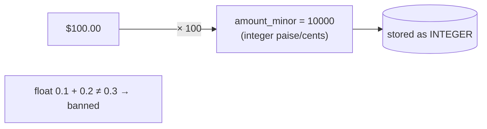

**Decision.** All money is stored as integer minor units (paise/cents) in `Integer` columns —
`amount_minor` and `amount_base_minor`. Floats are never used to *store* value.

**Insight.** Binary floating point cannot represent most decimal fractions exactly, so summing
floats silently drifts — unacceptable for money. Integer minor units sidestep the entire class
of rounding bugs: values are exact, comparisons are exact, and totals are associative. This is
the single most important correctness decision in the codebase, and it's enforced structurally
by the column type, not by convention. (The one float in the system, `fx_rate`, is a rate not a
balance — see ADR-08 for how it's kept out of the exact-money path.)

---

## ADR-07 — Normalise to base currency (INR) on write, never on read

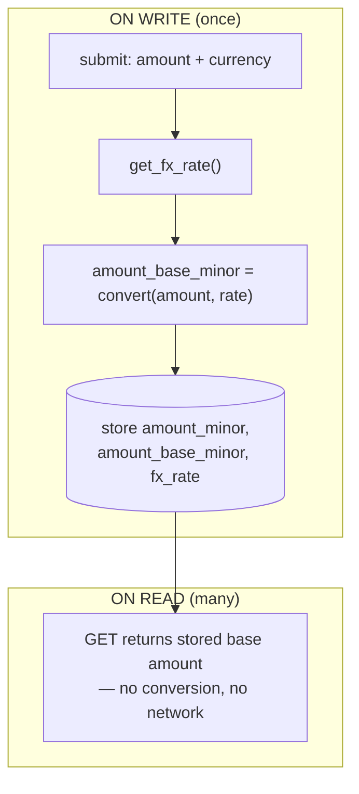

**Decision.** At submit time the amount is converted to INR and both the base amount and the
rate used are persisted. Reads return stored values; they never re-convert.

**Insight.** This is a write-once/read-many optimisation *and* an auditing decision. Converting
on write means every read is a cheap, deterministic, offline lookup — no FX call on the hot
read path. Storing the *rate that was actually used* (`fx_rate`) alongside the result makes each
expense reproducible and auditable: you can always explain how `amount_base_minor` was derived,
even after the market rate has moved. The cost — a stored value that reflects the rate at submit
time, not "now" — is exactly the behaviour an expense system wants: an expense is valued when
it is incurred.

---

## ADR-08 — Decimal + ROUND_HALF_UP for the conversion arithmetic

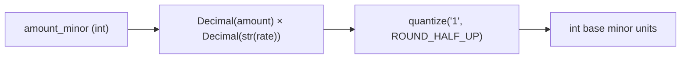

**Decision.** `_to_base_minor` converts with `Decimal`, multiplies by `Decimal(str(rate))`, and
quantises to an integer using explicit `ROUND_HALF_UP`.

**Insight.** This is the bridge that lets a float rate touch exact money without contaminating
it. Two subtleties do the work: `Decimal(str(rate))` converts the float *via its string form*,
avoiding the "0.1 is really 0.1000000000000000055" trap; and an **explicit rounding mode**
replaces Python's banker's-rounding default with the half-up rule most finance users expect.
The result re-enters the system as an `int`, so the money invariant from ADR-06 holds end to
end. Rounding policy is a business rule, and making it explicit means it's reviewable rather
than accidental.

---

## ADR-09 — FX rate from a pluggable external provider, with an identity short-circuit

```mermaid
flowchart TD
    start["get_fx_rate(source, base=INR)"] --> same{"source == base?"}
    same -->|yes| one["return 1.0<br/>(no network call)"]
    same -->|no| build["build params + optional access_key"]
    build --> call["httpx.GET FX_API_URL (timeout=10s)"]
    call --> ok{"rates[base] present?"}
    ok -->|yes| ret["return rate"]
    ok -->|no| err["raise 502 Bad Gateway"]
```

**Decision.** `get_fx_rate` calls an HTTP provider (Frankfurter by default) via `httpx` with a
10-second timeout, reads `rates[base]`, and maps a malformed response to `502`. When source
equals base it returns `1.0` and makes **no** network call. The provider URL and optional key
come from the environment.

**Insight.** Three good instincts in one function. (1) **The identity short-circuit** — an
INR-in-INR expense never leaves the process — is both a latency win and a robustness win: the
base-currency path can't be broken by an outage. (2) **The provider is configuration, not
code** (`FX_API_URL`), so swapping FX vendors is an env change. (3) **The failure boundary is
explicit** — a timeout is set and a garbled upstream payload becomes a clean `502` rather than a
`KeyError`/`500`, correctly signalling "the *upstream* failed, not your request." The obvious
next step, given a PoC, is caching rates and adding retries; the seam for both already exists.

---

## ADR-10 — Configuration and secrets from the environment (12-factor)

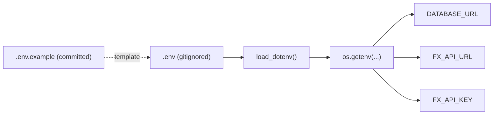

**Decision.** All environment-specific values (`DATABASE_URL`, `FX_API_URL`, `FX_API_KEY`) are
read via `os.getenv` with sane defaults; `python-dotenv` loads a local `.env`. `.env.example` is
committed as a template; `.env` and `*.db` are git-ignored. Nothing secret is hardcoded.

**Insight.** This is the 12-factor "config in the environment" rule, and it matters even for a
PoC because it's the difference between a demo and a leak. The committed `.env.example`
documents *what* knobs exist without exposing *values*; the gitignore keeps real secrets and
local data out of history. `load_dotenv()` is deliberately called before any app module imports
(note the `# noqa: E402` ordering in `main.py`) so config is populated before modules read it —
a subtle but real ordering dependency. Same code artifact runs in dev, test, and prod; only the
environment differs.

---

## ADR-11 — Expense lifecycle as an explicit state machine

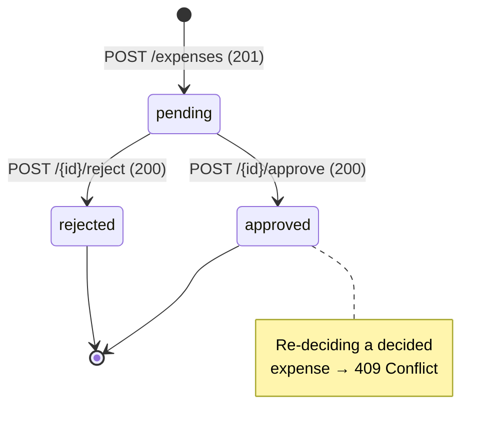

**Decision.** Status is one of three named constants (`pending`/`approved`/`rejected`), defaults
to `pending`, and only a `pending` expense may transition. `_decide()` returns `409 Conflict`
for any attempt to re-decide an already-decided expense.

**Insight.** Modelling the lifecycle as an explicit guarded transition — rather than letting any
endpoint set any status — makes an illegal move *unrepresentable through the API*. The single
`_decide` helper is the only writer of `status`, so approve and reject share one guard and can't
diverge. Returning `409` (not `400` or a silent overwrite) is the semantically honest answer:
the request was well-formed but conflicts with current state. This centralised guard is exactly
where an audit log or an idempotency key would later hook in.

---

## ADR-12 — HTTP-native error semantics

| Situation                         | Status | Where |
|-----------------------------------|:------:|-------|
| Expense created                   | `201`  | `submit_expense` |
| Invalid input (amount ≤ 0, etc.)  | `422`  | pydantic (automatic) |
| Unknown expense id                | `404`  | `_get_or_404` |
| Re-deciding a decided expense     | `409`  | `_decide` |
| Upstream FX response malformed    | `502`  | `get_fx_rate` |

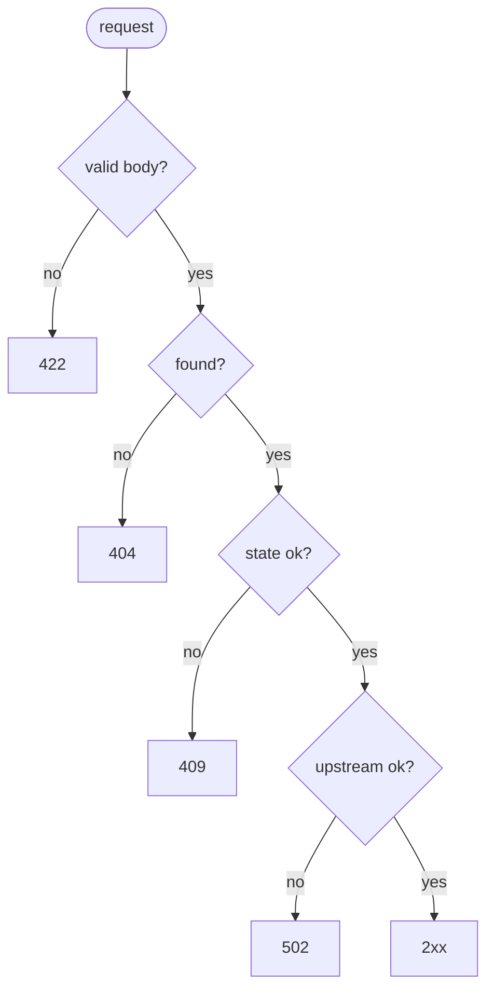

**Decision.** Each failure mode maps to the HTTP status that describes it, via `HTTPException`
(and pydantic for validation).

**Insight.** The status code *is* part of the API contract. Distinguishing `422` (your input is
bad) from `404` (it doesn't exist) from `409` (state conflict) from `502` (a dependency failed)
lets any HTTP-aware client — a retry layer, a UI, a monitor — react correctly without parsing
prose. Notably `502` is chosen over a generic `500` for upstream failures, which keeps *our*
error budget separate from the FX provider's. Correct status codes are the cheapest form of API
documentation.

---

## ADR-13 — Validate at the edge with declarative constraints

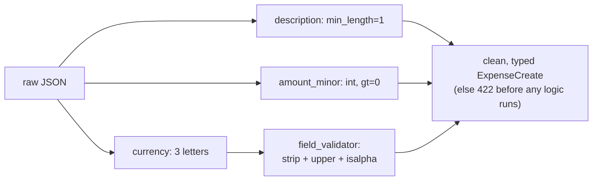

**Decision.** `ExpenseCreate` enforces `description` non-empty, `amount_minor > 0`, and
`currency` a 3-letter code, plus a `field_validator` that trims, upper-cases, and checks the
currency is alphabetic — all *before* the endpoint body runs.

**Insight.** Validation and normalisation happen once, at the boundary, so the rest of the code
operates on data it can trust — no defensive re-checking downstream. The `gt=0` constraint is
the schema-level partner to the integer-money rule (you can't submit a zero or negative
expense), and normalising `"usd" → "USD"` at the edge means the FX lookup and storage see one
canonical form. Pushing invariants to the type boundary shrinks the surface area where bugs can
live.

---

## ADR-14 — Schema bootstrap on startup via a lifespan handler (no migrations)

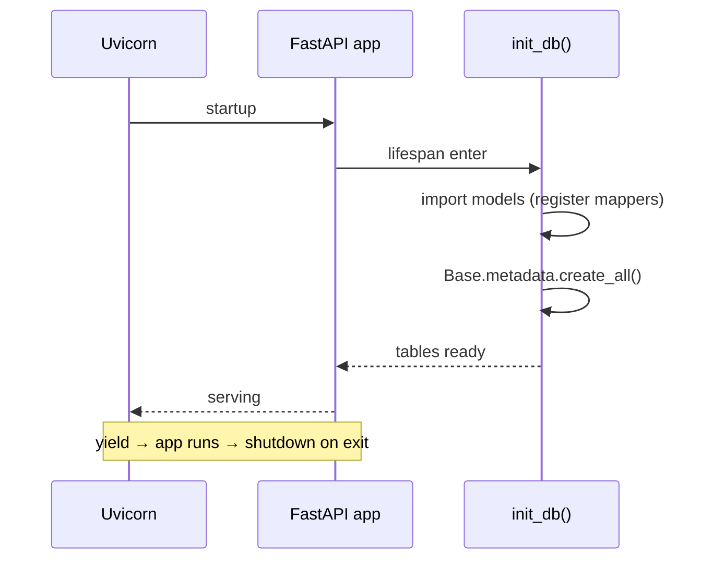

**Decision.** A `lifespan` async context manager calls `init_db()` on startup, which imports the
models (to register mappers) then runs `create_all()`. There is no migration tool.

**Insight.** `create_all()` is the right *PoC* answer — tables appear on first run, zero setup —
and the modern `lifespan` API is the right *mechanism* (it replaces the deprecated
`@app.on_event("startup")` and gives symmetric startup/shutdown). The deliberate limitation:
`create_all` only *creates missing* tables, it never *alters* existing ones, so the moment the
schema changes in a persistent database you need Alembic. That boundary — "fine until the schema
evolves against real data" — is the single clearest line between this PoC and production.
_(Working-tree note: this handler was removed in the last commit and re-added in the working
tree; the live design includes it.)_

---

## ADR-15 — Router modularity via `APIRouter`

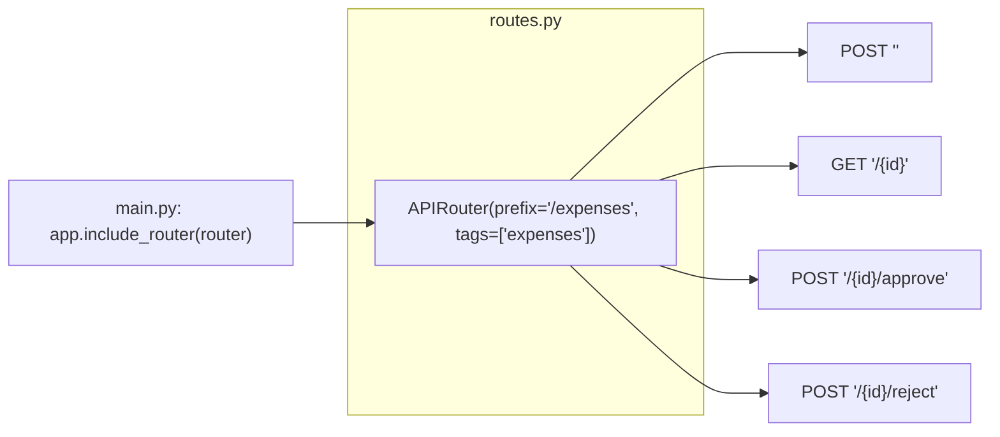

**Decision.** Endpoints are declared on an `APIRouter` with a shared `/expenses` prefix and an
`expenses` tag, and mounted in `main.py` via `include_router`.

**Insight.** Even with one resource, routing is kept separate from app assembly. The prefix
declares the resource once (no repeated `/expenses` strings to drift), the tag groups the
endpoints in the OpenAPI docs, and `main.py` stays a thin composition root. When a second
resource arrives it's a new router and one more `include_router` line — the growth pattern is
already established, not retrofitted.

---

## ADR-16 — Offline, isolated tests via DI override and monkeypatch

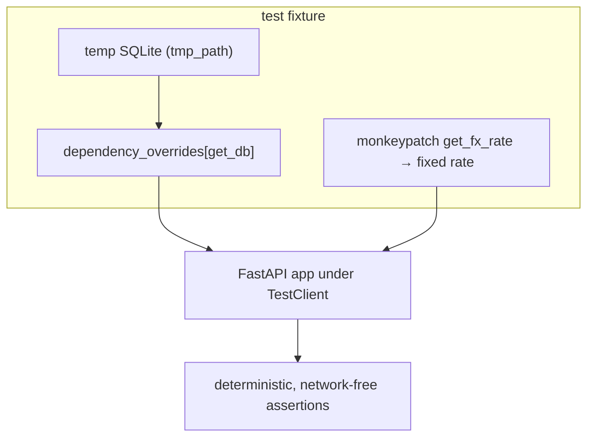

**Decision.** Integration tests override `get_db` with a per-test temp-file SQLite database and
monkeypatch `get_fx_rate` to a fixed rate; FX unit tests stub `httpx.get` directly. `conftest.py`
ensures the project root is importable. No test touches the network or the real DB.

**Insight.** This is where the earlier seams pay off. Because the DB session is *injected*
(ADR-04), a test swaps in an isolated database with one line — no global patching, no shared
state between tests. Because FX is a *named function* and the provider is *configuration*
(ADR-09), tests make the conversion deterministic without any HTTP. The result is a suite that
is fast, hermetic, and reproducible — the two hardest dependencies to test (a database and a
third-party API) are both neutralised by design decisions made for other reasons. Testability
here is a *consequence* of good boundaries, not a separate effort.

---

## ADR-17 — Timezone-aware UTC timestamps

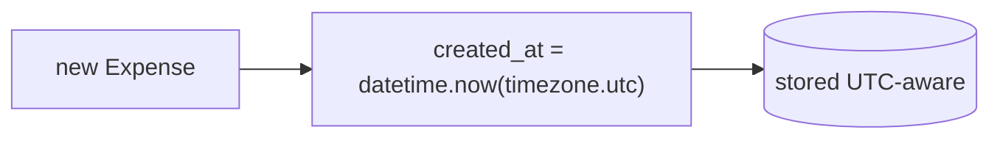

**Decision.** `created_at` defaults to `datetime.now(timezone.utc)` — timezone-aware, in UTC.

**Insight.** Storing UTC-aware timestamps (rather than naive local time) removes an entire
category of ambiguity: no "was this 3pm here or there?", no DST discontinuities, and a single
total order across events regardless of where the server runs. Localisation is a
presentation-layer concern applied on display; the stored truth stays UTC. Small line, but it's
the difference between timestamps you can reason about and timestamps you can only guess at.

---

## ADR-18 — Synchronous handlers with a blocking FX call (a conscious PoC simplification)

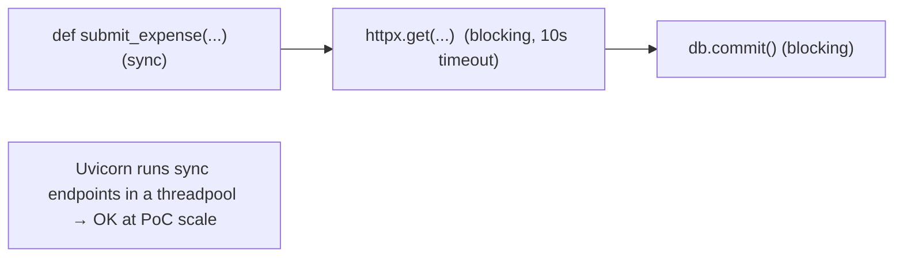

**Decision.** Endpoints are plain `def` (synchronous), and the FX lookup uses the **blocking**
`httpx.get`. Only the `lifespan` handler is async.

**Insight.** This is a legitimate simplification, and worth naming so it's a *choice* and not an
accident. FastAPI runs sync endpoints in a threadpool, so a blocking FX call doesn't stall the
event loop and the app stays correct under light load. The trade-off surfaces only at
concurrency: a synchronous 10-second FX call ties up a worker thread for its duration. The clean
upgrade path — `async def` endpoints with `httpx.AsyncClient` — is deliberately deferred because
PoC load doesn't justify the added complexity. Recognising *where* the simplification lives (the
outbound I/O call) is what makes it safe to defer.

---

## Cross-cutting themes

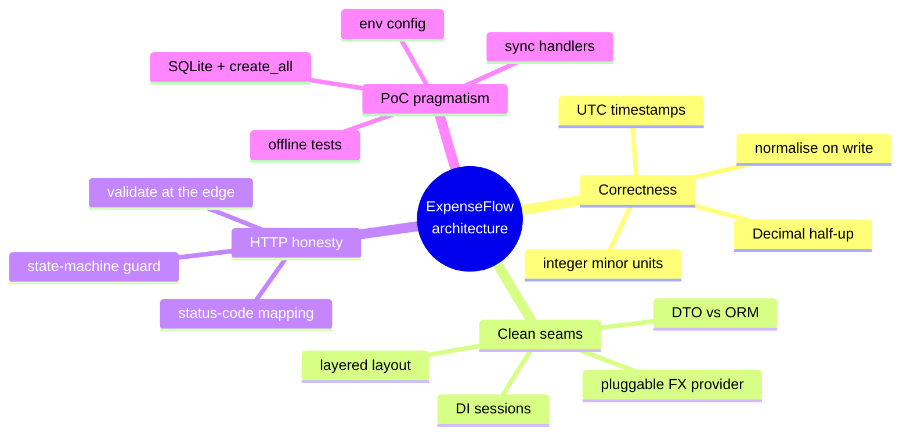

If there is one sentence to take away: **the PoC spends its complexity budget on financial
correctness and clean seams, and explicitly defers everything else** (migrations, async I/O, FX
caching, a service layer) behind boundaries that already exist. That is what makes it a *good*
proof of concept rather than merely a working one — the decisions that were skipped were skipped
on purpose, and the code shows you where to add them.
