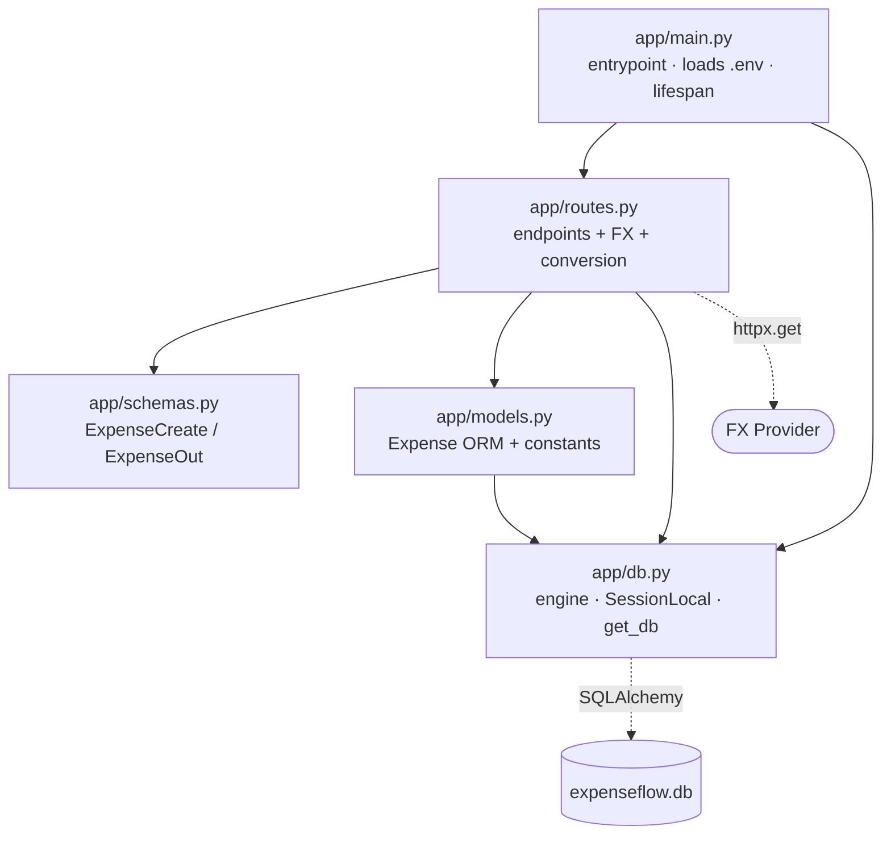
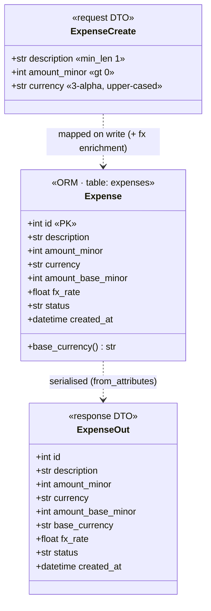
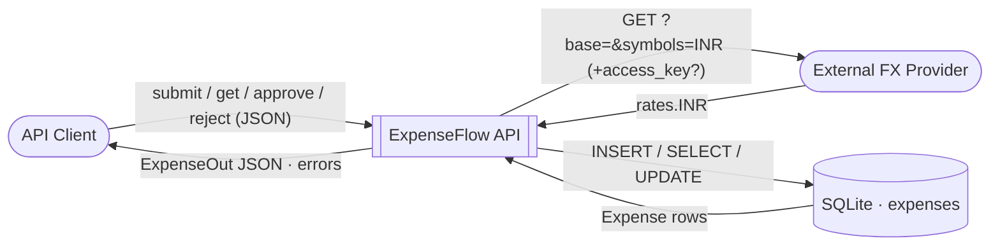
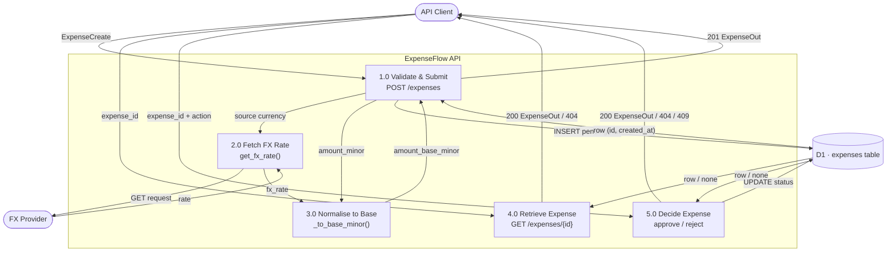
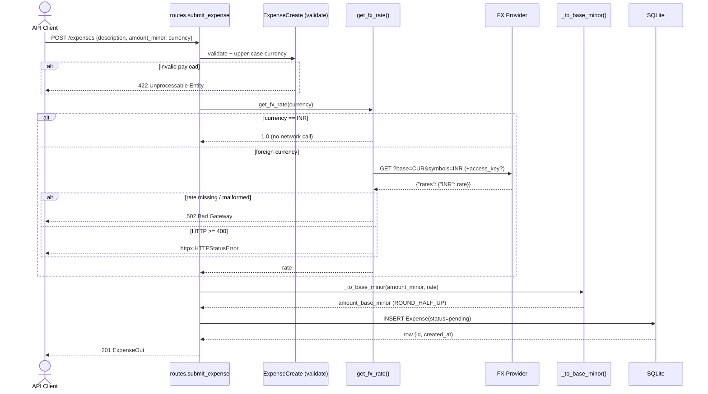
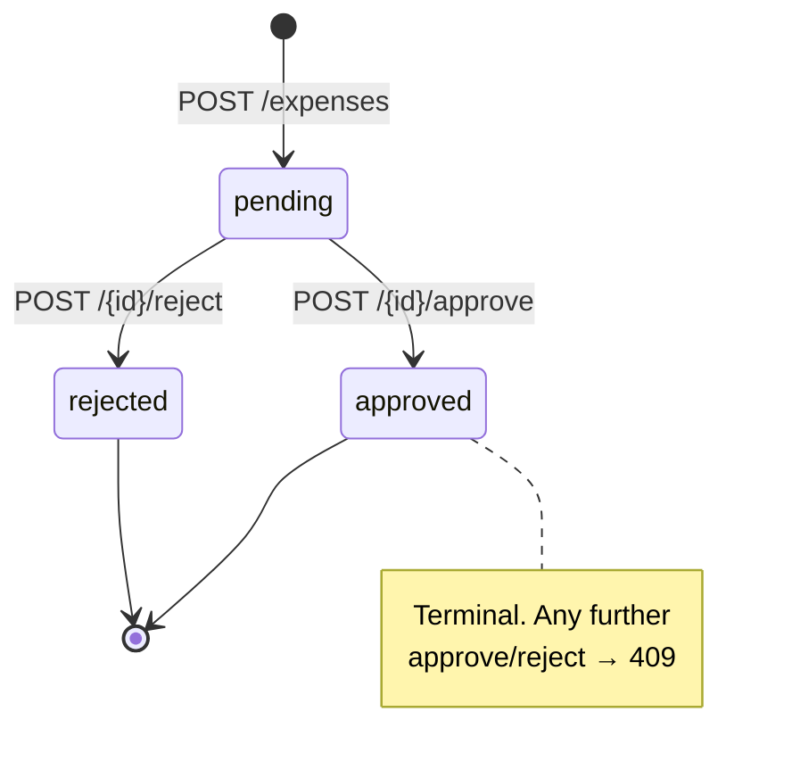

# ExpenseFlow API — Dataflow Documentation

Data flow, module map, and data models for the ExpenseFlow PoC.

Single user journey: **submit an expense → convert it to the base currency (INR) → approve or reject it.**

> All diagrams below are [Mermaid](https://mermaid.js.org/); they render inline on GitHub and in most Markdown viewers.

---

## 1. System at a glance

| Concern | Choice |
| --- | --- |
| Framework | FastAPI + Uvicorn (Python 3.12) |
| Persistence | SQLAlchemy ORM on SQLite (`expenseflow.db`) |
| External call | `httpx` GET to an FX-rate provider (Frankfurter by default, keyless) |
| Serialization | Pydantic v2 (`ExpenseCreate` in, `ExpenseOut` out) |
| Money | Integer **minor units** (paise/cents) — never float |
| Base currency | **INR**; every amount is normalised to base **on write** |

### External entities & trust boundary

- **API Client** — submits and decides expenses over HTTP/JSON.
- **FX Provider** — external HTTP service returning `rates.INR`. Configurable via `FX_API_URL` / `FX_API_KEY`.
- **SQLite store** — the `expenses` table in `expenseflow.db`.

---

## 2. Module map

Each source module and the data it owns:

| Module | Role | Owns / Produces | Inputs | Outputs |
| --- | --- | --- | --- | --- |
| `app/main.py` | Composition root / entrypoint | The `FastAPI` app instance | Env vars (via `python-dotenv`) | Mounted router; `init_db()` on startup |
| `app/db.py` | DB engine & session lifecycle | `engine`, `SessionLocal`, `Base`, `init_db()`, `get_db()` | `DATABASE_URL` | Per-request `Session` (dependency) |
| `app/models.py` | ORM layer | `Expense` table, status/currency constants | — | Persistent rows |
| `app/schemas.py` | API contract (validation & serialization) | `ExpenseCreate`, `ExpenseOut` | Raw JSON / ORM objects | Validated DTOs / JSON |
| `app/routes.py` | Endpoints + business logic | 4 routes, `get_fx_rate()`, `_to_base_minor()`, `_decide()`, `_get_or_404()` | HTTP requests, `Session`, FX rate | `ExpenseOut`, HTTP errors |

### Module dependency graph



---

## 3. Data models

### 3.1 Wire models (Pydantic v2) and ORM model



### 3.2 Data dictionary — `expenses` table

| Field | Type | Unit / Constraint | Source |
| --- | --- | --- | --- |
| `id` | int, PK | autoincrement | DB |
| `description` | str, not null | min length 1 | Client |
| `amount_minor` | int, not null | minor units of `currency`, > 0 | Client |
| `currency` | str(3), not null | ISO-4217, upper-cased | Client (normalised) |
| `amount_base_minor` | int, not null | **INR** minor units | Computed: `round_half_up(amount_minor × fx_rate)` |
| `fx_rate` | float, not null | base per 1 source unit | FX Provider (or `1.0`) |
| `status` | str, not null | `pending` \| `approved` \| `rejected` | System |
| `created_at` | datetime, not null | UTC | System default |

Constants (`app/models.py`): `BASE_CURRENCY = "INR"`, `STATUS_PENDING/APPROVED/REJECTED`.
`base_currency` on `ExpenseOut` is a read-only property returning `BASE_CURRENCY` — it is not a stored column.

---

## 4. Dataflow diagrams

### 4.1 Level 0 — Context diagram



### 4.2 Level 1 — Processes, stores, and flows



---

## 5. Endpoint flows (input → output)

| Method & path | Input | Success | Errors |
| --- | --- | --- | --- |
| `POST /expenses` | `ExpenseCreate` JSON | `201` + `ExpenseOut` (pending) | `422` invalid body · `502` FX unreadable · httpx error on FX HTTP failure |
| `GET /expenses/{id}` | path `id` | `200` + `ExpenseOut` | `404` not found |
| `POST /expenses/{id}/approve` | path `id` | `200` + `ExpenseOut` (approved) | `404` · `409` already decided |
| `POST /expenses/{id}/reject` | path `id` | `200` + `ExpenseOut` (rejected) | `404` · `409` already decided |

### 5.1 Submit & convert — sequence



### 5.2 Approve / Reject — sequence

```mermaid
sequenceDiagram
    actor C as API Client
    participant R as approve_expense / reject_expense
    participant D as _decide() / _get_or_404()
    participant DB as SQLite

    C->>R: POST /expenses/{id}/approve|reject
    R->>D: _get_or_404(id)
    D->>DB: SELECT by id
    alt not found
        DB-->>D: None
        D-->>C: 404 Not Found
    end
    DB-->>D: Expense
    alt status != pending
        D-->>C: 409 Conflict ("already {status}")
    else pending
        D->>DB: UPDATE status = approved|reject; commit; refresh
        DB-->>D: refreshed row
        D-->>C: 200 ExpenseOut
    end
```

---

## 6. Expense lifecycle (state)



---

## 7. Money normalisation (the core transformation)

Conversion happens **once, on write**, so every downstream read is already in base currency.

```
amount_base_minor = ROUND_HALF_UP( amount_minor × fx_rate )     # integer minor units
fx_rate           = 1.0                     if currency == INR   (no network call)
                  = rates.INR from provider otherwise
```

Worked example — submit `10000` USD minor units at rate `83.0`:

```
_to_base_minor(10000, 83.0) = round_half_up(Decimal(10000) × Decimal("83.0")) = 830000  # ₹8,300.00
```

`Decimal` + `ROUND_HALF_UP` is used deliberately to avoid binary-float drift on money.

---

## 8. Configuration & runtime

Environment variables (loaded from `.env` via `python-dotenv`; see `.env.example`):

| Var | Default | Used by |
| --- | --- | --- |
| `FX_API_URL` | `https://api.frankfurter.dev/v1/latest` | `routes.get_fx_rate` |
| `FX_API_KEY` | *(unset)* | added as `access_key` param only if present |
| `DATABASE_URL` | `sqlite:///expenseflow.db` | `db.create_engine` |

**Startup:** `main.py` loads env → `init_db()` (via lifespan) creates tables → router mounted.
**Per request:** `get_db()` yields a `Session` and closes it when the request ends.

---

## 9. Notes / observations

- `CLAUDE.md` still says the project is "not yet implemented" — that is **stale**; all `app/` modules, tests, and the DB now exist. Worth updating.
- The working tree's `app/main.py` re-introduces the `lifespan`/`init_db()` handler that commit `c05bfaa` had removed (`git status` shows it modified). Tests deliberately **skip** lifespan (no `with TestClient(...)`) so the real `expenseflow.db` is never touched, and stub `get_fx_rate` so no network is hit.
- FX failures surface two ways: a malformed/missing rate → `502`; an HTTP ≥ 400 from the provider → the raw `httpx.HTTPStatusError` propagates.
